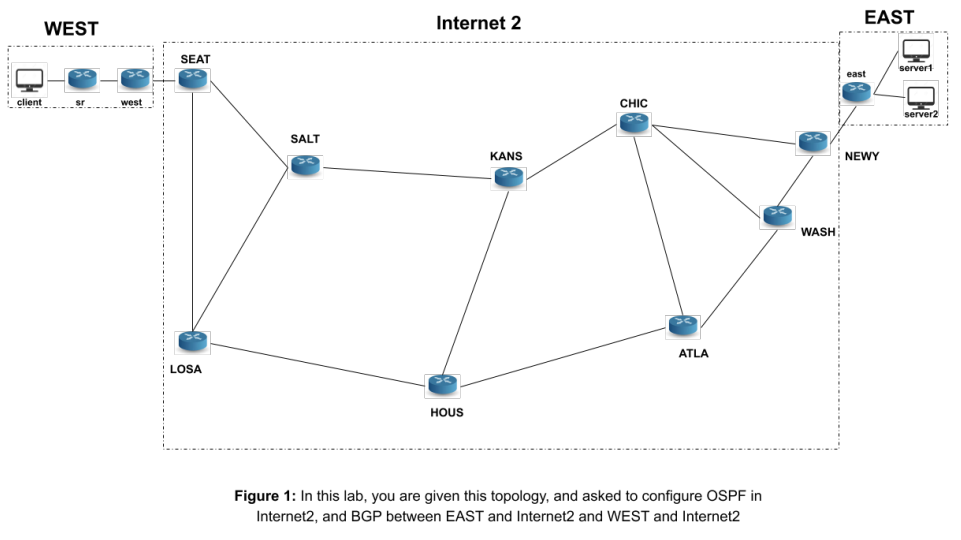

# Internet-Configuration-with-Quagga-CLI
### CS551-Lab2
Setting up a valid forwarding state within an autonomous system (AS) using OSPF, an intra-domain routing protocol (Part A).

Then, set up valid forwarding state between different ASes, so that an end-host in one AS can communicate with a server in another AS via an intermediate AS (Part B). To do that, the inter-domain routing protocol BGP is needed to be used.

Both OSPF and BGP are configured through Quagga software routing suite, which runs on several virtual routers in virtual machine (VM).

Last, for both parts, I wrote Python scripts to automatically load the configuration for the system booting up

## How to Run
* PartA
  
  Before getting started to configuration, you can start this topology by typing the set of commands below in a terminal:

  `sudo bash`

  `killall ovs_controller`

  `mn -c`

  `python internet2.py`

  Scripting Configurations:
    * load_configs.py: This script should automate the loading of the configs for all the routers in Internet2
    * config_i2_hosts.py: This script should automate configuring each Internet2 host's interface and configuring the default route.
* PartB
  To start the topology for this part, type the following commands:

  `sudo bash`

  `killall ovs_controller`

  `mn -c`

  `sh config.sh`

  `python multiAS.py`

  Scripting Configurations:
    * load_configs_multiAS.py: This script should automate the loading of the OSPF and BGP configs for all the routers in Internet2